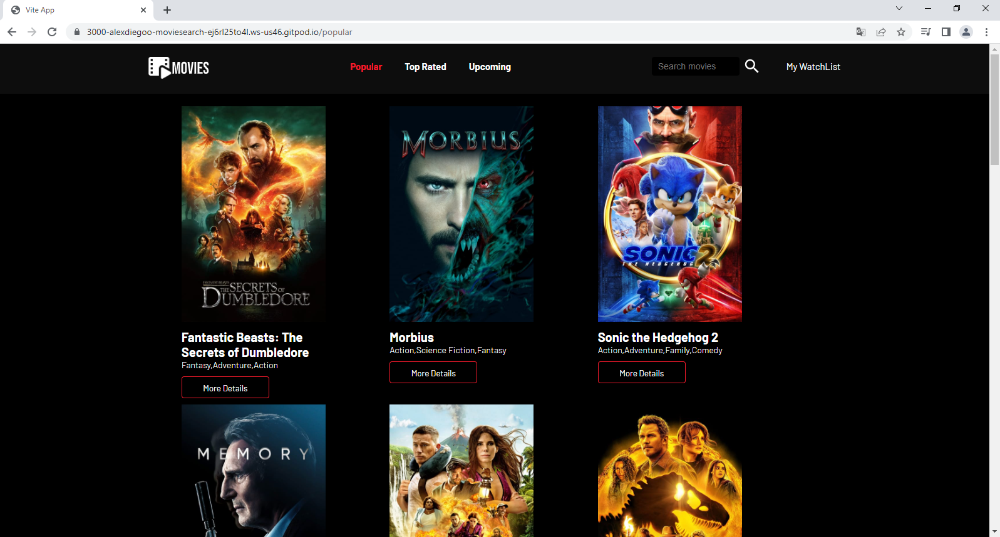
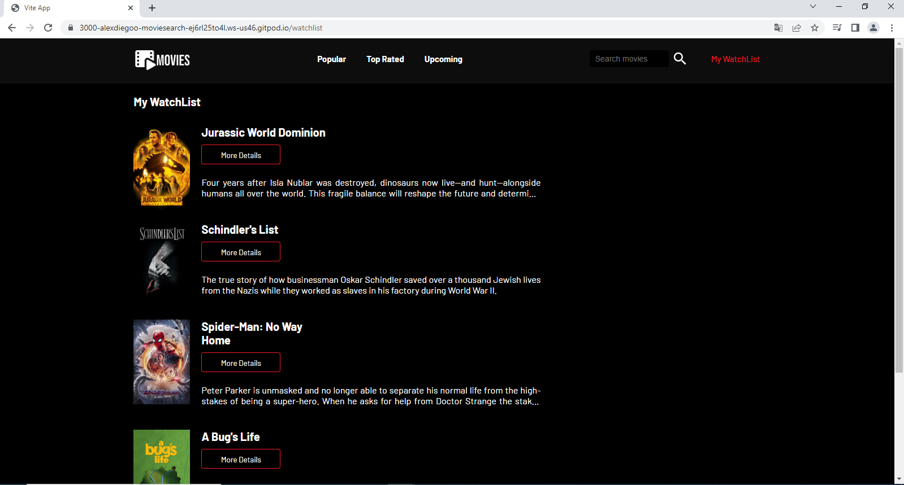
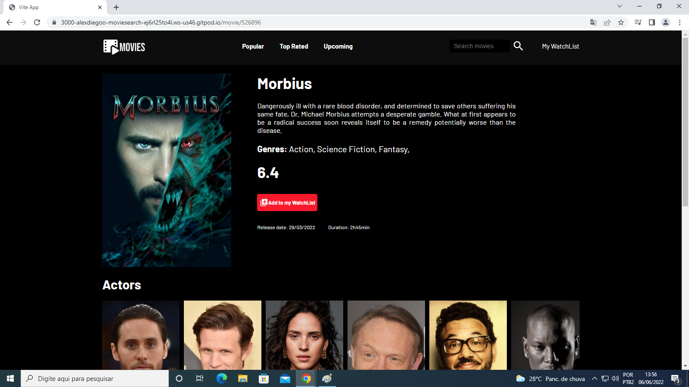

## Movie Search App

 

 

### Sobre 

Um web app para buscar filmes de várias categorias.

#### Funcionalidades:
- O usuario pode procurar filmes pelas categorias ( Popular, Top rated e Upcoming)
- O usuario pode buscar um filme digitando no campo de busca.
- O usuario pode salvar e remover um filme na sua watchlist
- O usuario pode ver os detalhes de um filme.

#### Tecnologias usadas:
- React
- React Router Dom
- Axios
- Styled-components
- React icons

 

  

 

  #### Página inicial:
 
  #### WatchList:
 
  #### Página de detalhes: 
 

 

### Como testar o projeto:

`1- Criar uma conta no The Movie DB API e pegar uma key`
 

`2- Clonar o projeto`
 

`3- Criar a pasta e arquivo src/environment/index.js`
 

`4- Dentro de src/environment/index.js`
~~~js
export const Environment = {
  API_KEY: SUA_KEY,
  BASE_URL: 'https://api.themoviedb.org/3/',
}
~~~
 

`5- Rodar npm run dev`